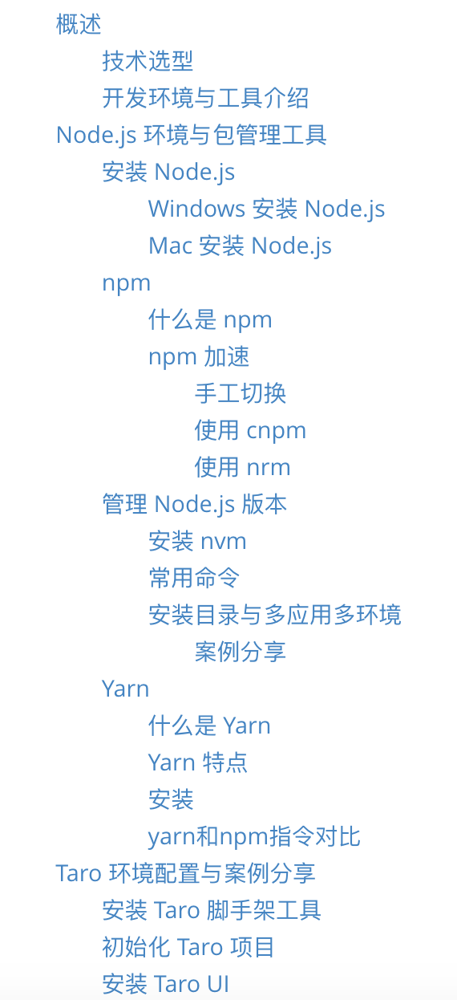
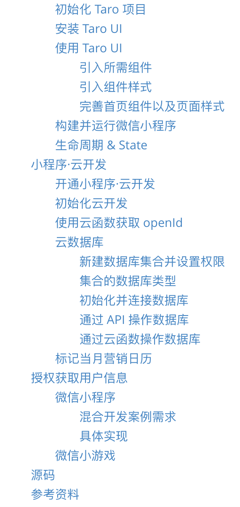

# 小马宋营销日历


## 说明

[Taro](https://github.com/NervJS/taro) + [Taro UI](https://github.com/NervJS/taro-ui) + [小程序·云开发](https://developers.weixin.qq.com/miniprogram/dev/wxcloud/basis/getting-started.html) 开发的微信小程序，小程序中营销日历贴图版权为@小马宋所有

## 安装与运行

首先需要全局安装 cli 开发工具 `@tarojs/cli`,安装方式二者选其一

```bash
$ npm i -g @tarojs/cli 
$ yarn global add @tarojs/cli
```


然后执行如下命令

```bash
$ npm run dev:weapp
$ npm run build:weapp
# 仅限全局安装
$ taro build --type weapp --watch
$ taro build --type weapp
```

编译完成后，需要自行下载并打开 [微信开发者工具](https://developers.weixin.qq.com/miniprogram/dev/devtools/download.html)，然后选择项目根目录下 dist  目录进行预览


## 更多参考资料


| 目录一 | 目录二 | GitChat |
| :----: | :----: | :-----: |
| |||


